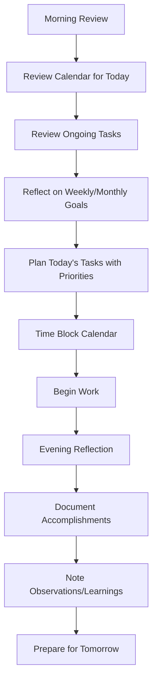
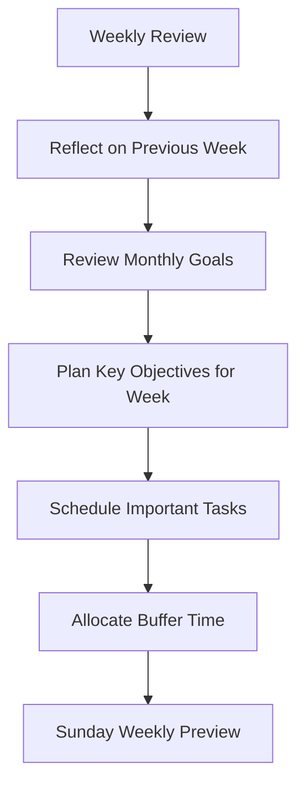

# Planning & Goals

## Overview

Consilium's planning system helps users manage their goals across different time horizons, from long-term aspirations to daily tasks. The system is designed to create alignment between high-level aspirational directions and day-to-day activities, with AI agents providing guidance and assistance throughout the process.

## Planning Hierarchy

### 5-Year Goals
- Aspirational direction and desired personal growth
- High-level categories for development (Career, Health, Relationships, etc.)
- Qualitative outcomes with flexible timelines
- Used as a north star for all other planning activities
- Focus on "becoming" and development rather than specific measurable outcomes

### 1-Year Goals
- Medium-term objectives that move toward 5-year aspirations
- More defined direction with some measurable components
- Typically reviewed quarterly
- Progress tracking with milestones
- Balance between aspirational development and concrete outcomes

### Monthly Goals
- Concrete objectives that support 1-year goals
- Specific and measurable targets to achieve within the month
- Balanced across different life areas
- Regular check-ins throughout the month

### Weekly Planning
- Specific tasks and activities to advance monthly goals
- Calendar integration for time blocking
- Prioritization of activities
- Buffer time for unexpected events
- Direct alignment with higher-level aspirations

### Daily Planning
- Concrete actions with time estimates
- Integration with calendar and task management
- Morning planning and evening reflection
- Adjustment based on energy levels and priorities
- Clear "line of sight" from daily tasks to broader life direction

## Graduated Specificity

The planning system recognizes that goals naturally become more specific and measurable as they move from long-term to short-term:

- **Long-term goals** (5-Year): Focus on aspirational direction, personal growth, and "becoming"
- **Mid-term goals** (1-Year): Balance between aspiration and defined outcomes
- **Short-term goals** (Monthly/Weekly/Daily): Increasingly specific, measurable, and directly actionable

This graduated approach allows users to maintain an inspiring vision while still having concrete actions to take each day.

## Multi-Agent Planning System

Consilium uses a multi-agent AI system to provide specialized assistance across different planning domains:

### Agent Architecture

- **Planner Agent**: A primary agent that orchestrates planning activities, coordinates between specialized agents, and synthesizes recommendations into cohesive plans
- **Domain-Specific Agents**: Specialized agents that focus on specific life areas, providing tailored recommendations based on relevant goals and context

### Sample Domain Agents

- **Spiritual Agent**: Focuses on spiritual growth, practices, and relationship goals
  - Accesses: Spiritual goals, relationship goals, relevant reflection history
  - Provides: Recommendations for spiritual practices, relationship nurturing activities
  
- **Health Agent**: Specializes in physical wellbeing, exercise, and nutrition
  - Accesses: Health goals, exercise history, weight metrics, nutrition data
  - Provides: Workout recommendations, nutrition guidance, health activity scheduling
  
- **Work Agent**: Concentrates on professional goals and productivity
  - Accesses: Career goals, work projects, deadlines, meeting schedules
  - Provides: Work prioritization, productivity recommendations, professional development suggestions

### Agent Discovery

The multi-agent system implements a discovery mechanism allowing agents to share relevant information:
- Agents can query other agents for information needed to make better recommendations
- The Planner Agent integrates recommendations from all domain agents into a cohesive plan
- Information flows between agents to resolve conflicts and optimize the overall plan

### Agent Coordination Example

Below is an example of how agents might coordinate for daily planning:

```
User: "I need to plan my Thursday. I'm feeling a bit anxious about how much I need to get done this week."

Planner Agent: [Internal thought process] The user needs help planning their day and has mentioned feeling anxious. I should gather relevant information from various tools and consult with domain agents.

First, the Planner Agent retrieves calendar events for Thursday from the Calendar Tool, which returns a team standup meeting in the morning, a quarterly presentation to the leadership team in the afternoon, and a reminder to pick up dry cleaning after work.

Next, the Planner Agent requests all active tasks from the Task Tool, which returns both weekly planned tasks (including a high-priority task to finish presentation slides, a medium-priority task to review Q3 metrics for tomorrow's meeting, and a task to schedule 1:1s with team members) and general tasks (including sending a follow-up email to marketing, updating project documentation, and researching a new productivity tool).

With this information gathered, the Planner Agent reaches out to domain-specific agents:

Planner Agent → Health Agent: The Planner shares the user's anxiety, calendar events, and tasks, asking for health-related recommendations.

Health Agent → Planner Agent: "From the user's last reflection on Monday, they noted feeling more focused after morning exercise. The user's health goals include 'exercise 3x weekly' which they're currently at 1/3 for this week. Given their anxiety, I'd suggest a morning workout before the team standup to help reduce stress. Also, consider recommending short breaks throughout the day and avoiding too much caffeine, which can increase anxiety."

Planner Agent → Work Agent: The Planner shares the same context, asking for work-related prioritization and preparation recommendations.

Work Agent → Planner Agent: "From last week's planning session, the user mentioned needing quiet time to review slides before presentations. I see the slides are due today, but they should still allocate time to review the Q3 metrics task before the presentation. In a reflection two weeks ago, they noted feeling rushed into their last presentation. Based on their work goal of 'improve presentation skills,' I'd recommend scheduling 45-60 minutes of preparation time before the presentation and blocking off some time afterward to document any action items."

Planner Agent → Spiritual Agent: The Planner shares the same context, asking for spiritual practices that might help with anxiety.

Spiritual Agent → Planner Agent: "In the stored memory from the /remember command, the user noted: 'I prefer a short meditation session before important meetings to calm my nerves.' There's also a spiritual goal about 'maintaining perspective during work stress.' Given their mentioned anxiety, a brief morning meditation and perhaps a few minutes of centering before the presentation would align with these patterns."

Planner Agent → User: "Here's a suggested plan for Thursday, taking into account your anxiety and helping you manage everything on your plate:

7:30-8:00 AM: Morning exercise (supports your weekly exercise goal, currently at 1/3 for the week, and helps reduce anxiety)
8:00-8:15 AM: Brief meditation (aligns with your preference for centering on stressful days)
8:30-9:00 AM: Team standup
9:00-10:30 AM: Review Q3 metrics for your presentation (due tomorrow)
10:30-10:45 AM: Short break
10:45-12:00 PM: Send follow-up email to marketing and work on project documentation (from your general task list)
12:00-1:00 PM: Lunch break (suggest eating away from your desk to reset)
1:00-1:45 PM: Final preparation time for your presentation
1:45-2:00 PM: Quick centering break
2:00-3:30 PM: Quarterly presentation to leadership team
3:30-4:00 PM: Document action items from presentation while fresh in your mind
4:00-5:00 PM: Begin scheduling 1:1s with team members (due Friday)
5:00 PM: Pick up dry cleaning

This plan balances your scheduled events, priority tasks, and well-being needs. It addresses both your weekly planned tasks and some items from your general task list. Would you like to adjust anything?"

User: "I won't have time for exercise in the morning tomorrow. What about an evening workout instead?"

The Planner Agent then consults the Health Agent about this adjustment, sharing the user's feedback.

Health Agent → Planner Agent: "While there's no specific preference noted about evening workouts in their records, an evening workout would still help them progress toward their weekly exercise goal. Given the presentation and their anxiety, a moderate activity in the evening could help release tension after the day. For anxiety management, suggest they still take a few short walking breaks during the day to reset."

Planner Agent → User: "I understand about the morning time constraint. Instead, I could suggest a 30-minute moderate workout around 6:00 PM after your presentation and errands. This would still count toward your weekly exercise goal while helping release tension from the day. In addition, try to take a few 5-minute walking breaks between tasks during the day to help manage anxiety. How does that sound?"
```

This example shows how:
1. The Planner Agent gathers relevant information from calendar and task tools
2. Domain agents analyze the context and offer specialized recommendations
3. The plan synthesizes all available information into a balanced schedule
4. Feedback is processed by consulting with the relevant domain agent
5. The final plan incorporates both the user's constraints and the agents' expertise

### Agent Configuration

- Users can configure agent templates to customize what context is provided to each agent
- LLM prompts can be refined over time to improve agent performance
- Relevant goals from different time horizons can be attached to appropriate domain agents

## Planning Workflows

### Daily Planning Workflow



### Weekly Planning Workflow



## AI Integration

### Planning Assistance

- **Context-Aware Goal Guidance**:
  - For long-term goals: Help clarify vision and direction without forcing specificity
  - For mid-term goals: Balance aspiration with some measurable elements
  - For short-term goals: Focus on making objectives specific, measurable, and actionable

- **Goal Alignment**: Ensure clear connections between daily/weekly tasks and higher-level aspirations

- **Task Breakdown**: Suggestions for breaking down goals into actionable tasks appropriate to their time horizon

- **Prioritization**: Assistance with prioritizing tasks based on alignment with higher-level goals and constraints

- **Time Estimation**: Realistic time estimates for tasks based on past performance

- **Balance Checking**: Ensures plans are balanced across different life areas

### Agent Memory System

- **Memory Implementation**: Leverages CrewAI's built-in memory systems (short-term, long-term, entity, contextual)
- **Memory Commands**:
  - `/remember` command allows users to explicitly store important preferences and information
  - Example: `/remember I prefer spiritual reading in the evening when the house is quiet`
- **Memory Management**: A dedicated interface to view and delete stored memories

### Reflection Support

- **Progress Analysis**: AI-driven analysis of progress toward goals, with context-appropriate metrics
  - Qualitative analysis for long-term aspirational goals
  - Mixed qualitative/quantitative analysis for mid-term goals
  - Quantitative metrics for short-term specific goals

- **Pattern Recognition**: Identifying patterns in productivity and obstacles

- **Insight Generation**: Highlighting insights from daily/weekly reflections

- **Adjustment Recommendations**: Suggestions for adjusting goals and plans as needed while maintaining alignment with long-term direction

## Technical Implementation

### Data Model

```
Goal {
  id: UUID
  title: String
  description: Text
  created_at: Timestamp
  updated_at: Timestamp
  user_id: UUID
  timeframe: Enum (5-year, 1-year, monthly, weekly, daily)
  parent_goal_id: UUID (for hierarchical relationship)
  status: Enum (not_started, in_progress, completed, deferred)
  progress: Integer (0-100) or null (for aspirational goals)
  priority: Enum (high, medium, low)
  due_date: Date (optional)
  goal_type: Enum (aspirational, developmental, specific)
  metrics: JSON (optional, for measurable goals only)
  metadata: JSON
}

Reflection {
  id: UUID
  content: Text
  created_at: Timestamp
  user_id: UUID
  reflection_type: Enum (daily, weekly, monthly, quarterly, yearly)
  related_goals: UUID[] (array of goal IDs)
  qualitative_progress: Text (for aspirational/developmental goals)
  metrics: JSON (optional, for tracking specific metrics on measurable goals)
}

PlanningSession {
  id: UUID
  started_at: Timestamp
  ended_at: Timestamp
  user_id: UUID
  session_type: Enum (daily, weekly, monthly, quarterly, yearly)
  notes: Text
  created_goals: UUID[] (array of goal IDs)
  updated_goals: UUID[] (array of goal IDs)
}

AgentMemory {
  id: UUID
  content: Text
  created_at: Timestamp
  user_id: UUID
  memory_type: Enum (preference, observation, feedback)
  is_active: Boolean
  metadata: JSON
}

AgentConfig {
  id: UUID
  name: String
  description: Text
  user_id: UUID
  agent_type: String
  prompt_template: Text
  context_template: Text
  associated_goals: UUID[] (array of goal IDs)
  created_at: Timestamp
  updated_at: Timestamp
  is_active: Boolean
}
```

### Integration with Other Features

- **Calendar**: Two-way sync with calendar for time blocking
- **Tasks**: Goals can be broken down into trackable tasks
- **Notes**: Planning sessions can reference and be saved as notes
- **Chat**: Planning can be initiated and guided through the chat interface

## User Experience

### Planning Session Flow

1. **Initiation**: User starts planning session (daily, weekly, monthly, etc.)
2. **Context Gathering**: System gathers relevant goals, calendar, tasks, and notes
3. **AI Guidance**: Planning agent guides user through appropriate workflow based on time horizon:
   - For long-term planning: Focus on aspirations, values, and direction
   - For mid-term planning: Bridge aspirations to more concrete outcomes
   - For short-term planning: Create specific, actionable tasks aligned with higher goals
4. **Reflection**: User reflects on progress with metrics appropriate to goal type:
   - Qualitative reflection for aspirational goals
   - Mixed metrics for developmental goals
   - Specific metrics for concrete goals
5. **Forward Planning**: Create new goals and tasks aligned with higher-level objectives
6. **Documentation**: Session results are saved for future reference

### Agent Interaction Flow

1. **Initial Planning Request**: User initiates planning or asks for recommendations
2. **Domain Agent Activation**: Relevant domain agents are activated based on the request
3. **Context Collection**: Each agent collects relevant information from its domain
4. **Discovery Process**: Agents exchange information through discovery mechanism
5. **Recommendation Generation**: Each agent generates domain-specific recommendations
6. **Plan Synthesis**: Planner Agent combines all recommendations into a cohesive plan
7. **Feedback Loop**: User can direct feedback to specific agents for plan refinement

### Visual Representations

- **Goal Hierarchy**: Visual representation of goal relationships showing alignment from daily tasks to 5-year aspirations
- **Progress Tracking**: 
  - Qualitative narratives for aspirational goals
  - Mixed qualitative/quantitative tracking for developmental goals
  - Charts and metrics for specific measurable goals
- **Burn-down Charts**: Visual tracking of tasks completion
- **Time Allocation**: Visualization of time spent across different goal areas
- **Alignment View**: Clear visualization of how daily/weekly activities support long-term aspirations

## Handwritten Integration

- **Paper Templates**: Printable templates for paper planning
- **Photo Capture**: Take photos of handwritten plans for digital integration
- **OCR Processing**: Automatic extraction of handwritten goals and reflections
- **Digital+Analog Workflow**: Seamless flow between digital and analog planning 