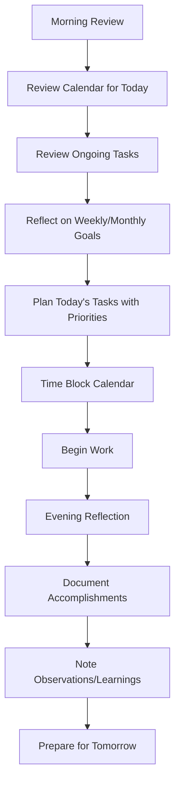
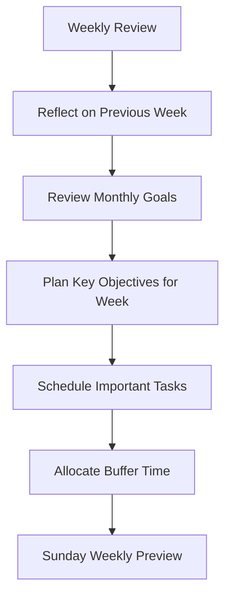

# Planning & Goals

## Overview

Consilium's planning system helps users manage their goals across different time horizons, from long-term aspirations to daily tasks. The system is designed to create alignment between high-level objectives and day-to-day activities, with AI agents providing guidance and assistance throughout the process.

## Planning Hierarchy

### 5-Year Goals
- Long-term aspirations and life direction
- High-level categories (Career, Health, Relationships, etc.)
- Measurable outcomes with flexible timelines
- Used as a north star for all other planning activities

### 1-Year Goals
- Medium-term objectives derived from 5-year goals
- More specific and measurable targets
- Typically reviewed quarterly
- Progress tracking with milestones

### Monthly Goals
- Concrete objectives derived from 1-year goals
- Specific outcomes to achieve within the month
- Balanced across different life areas
- Regular check-ins throughout the month

### Weekly Planning
- Specific tasks to advance monthly goals
- Calendar integration for time blocking
- Prioritization of activities
- Buffer time for unexpected events

### Daily Planning
- Concrete actions with time estimates
- Integration with calendar and task management
- Morning planning and evening reflection
- Adjustment based on energy levels and priorities

## Planning Workflows

### Daily Planning Workflow



### Weekly Planning Workflow



## AI Integration

### Planning Assistance

- **Goal Refinement**: AI helps refine vague goals into specific, measurable objectives
- **Task Breakdown**: Suggestions for breaking down goals into actionable tasks
- **Prioritization**: Assistance with prioritizing tasks based on goals and constraints
- **Time Estimation**: Realistic time estimates for tasks based on past performance
- **Balance Checking**: Ensures plans are balanced across different life areas

### Reflection Support

- **Progress Analysis**: AI-driven analysis of progress toward goals
- **Pattern Recognition**: Identifying patterns in productivity and obstacles
- **Insight Generation**: Highlighting insights from daily/weekly reflections
- **Adjustment Recommendations**: Suggestions for adjusting goals and plans as needed

## Technical Implementation

### Data Model

```
Goal {
  id: UUID
  title: String
  description: Text
  created_at: Timestamp
  updated_at: Timestamp
  user_id: UUID
  timeframe: Enum (5-year, 1-year, monthly, weekly, daily)
  parent_goal_id: UUID (for hierarchical relationship)
  status: Enum (not_started, in_progress, completed, deferred)
  progress: Integer (0-100)
  priority: Enum (high, medium, low)
  due_date: Date (optional)
  metadata: JSON
}

Reflection {
  id: UUID
  content: Text
  created_at: Timestamp
  user_id: UUID
  reflection_type: Enum (daily, weekly, monthly, quarterly, yearly)
  related_goals: UUID[] (array of goal IDs)
  metrics: JSON (optional, for tracking specific metrics)
}

PlanningSession {
  id: UUID
  started_at: Timestamp
  ended_at: Timestamp
  user_id: UUID
  session_type: Enum (daily, weekly, monthly, quarterly, yearly)
  notes: Text
  created_goals: UUID[] (array of goal IDs)
  updated_goals: UUID[] (array of goal IDs)
}
```

### Integration with Other Features

- **Calendar**: Two-way sync with calendar for time blocking
- **Tasks**: Goals can be broken down into trackable tasks
- **Notes**: Planning sessions can reference and be saved as notes
- **Chat**: Planning can be initiated and guided through the chat interface

## User Experience

### Planning Session Flow

1. **Initiation**: User starts planning session (daily, weekly, etc.)
2. **Context Gathering**: System gathers relevant goals, calendar, tasks, and notes
3. **AI Guidance**: Planning agent guides user through appropriate workflow
4. **Reflection**: User reflects on progress and captures learnings
5. **Forward Planning**: Create new goals and tasks aligned with higher-level objectives
6. **Documentation**: Session results are saved for future reference

### Visual Representations

- **Goal Hierarchy**: Visual representation of goal relationships
- **Progress Tracking**: Charts and metrics showing progress over time
- **Burn-down Charts**: Visual tracking of tasks completion
- **Time Allocation**: Visualization of time spent across different goal areas

## Handwritten Integration

- **Paper Templates**: Printable templates for paper planning
- **Photo Capture**: Take photos of handwritten plans for digital integration
- **OCR Processing**: Automatic extraction of handwritten goals and reflections
- **Digital+Analog Workflow**: Seamless flow between digital and analog planning

## Future Enhancements

- **Social Accountability**: Optional sharing of goals with accountability partners
- **Advanced Analytics**: Deeper insights into planning patterns and effectiveness
- **Habit Integration**: Connect habits and routines to goal achievement
- **AI-Generated Planning Templates**: Personalized planning frameworks based on user preferences and effectiveness 