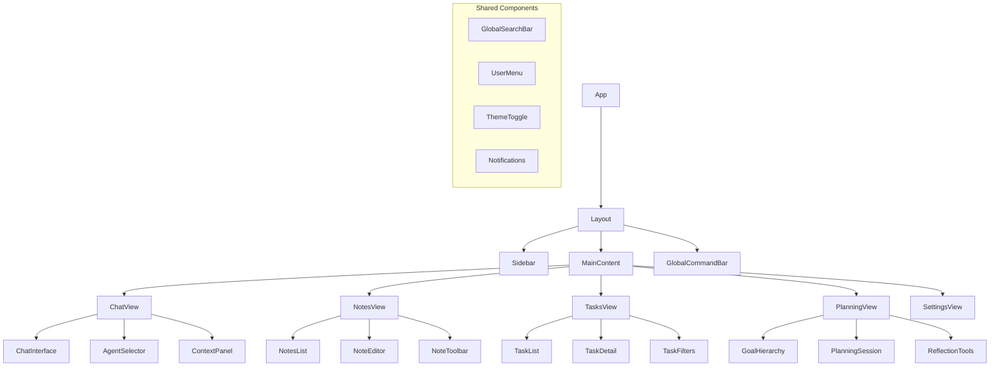

# Frontend Technical Design

## Overview

The Consilium frontend is built as a Progressive Web Application (PWA) using React, designed to provide a responsive, app-like experience across devices while maintaining offline capabilities. The architecture emphasizes component reusability, state management, and seamless integration with the backend.

## Technology Stack

### Core Framework

- **React**: Component-based UI library
- **TypeScript**: Static typing for improved code quality and developer experience
- **Vite**: Fast build tooling for modern web development

### UI Components

- **Tailwind CSS**: Utility-first CSS framework for styling
- **Headless UI**: Unstyled, accessible UI components
- **reachat**: Chat UI components for the central conversation interface
- **BlockNotes**: Rich text editor for note-taking functionality
- **Custom Components**: Purpose-built components for specific features

### State Management

- **Redux Toolkit**: Centralized state management
- **React Query**: Data fetching, caching, and state management for API data
- **Context API**: Local state management for component trees

### Routing

- **React Router**: Client-side routing
- **Protected Routes**: Authentication-based access control

### PWA Features

- **Service Workers**: Enable offline functionality and background syncing
- **Web App Manifest**: For installable experience on devices
- **Workbox**: Service worker generation and management

### Storage

- **DexieJS**: IndexedDB wrapper for client-side storage
- **LocalForage**: Fallback storage mechanism
- **Session Storage**: For temporary, session-based data

## Application Architecture

### Directory Structure

```
src/
├── assets/           # Static assets (icons, images)
├── components/       # Reusable UI components
│   ├── common/       # General-purpose components
│   ├── chat/         # Chat interface components
│   ├── notes/        # Note editor components
│   ├── planning/     # Planning interface components
│   └── tasks/        # Task management components
├── hooks/            # Custom React hooks
├── pages/            # Top-level page components
├── services/         # API and service integrations
│   ├── api/          # API client and endpoints
│   ├── auth/         # Authentication services
│   ├── storage/      # Storage services
│   └── agents/       # Agent interaction services
├── store/            # Redux state management
├── types/            # TypeScript type definitions
├── utils/            # Utility functions
├── App.tsx           # Main application component
└── main.tsx          # Application entry point
```

### Component Architecture



## Key Features Implementation

### Chat Interface

The chat interface is the central interaction point in Consilium, implementing:

- **Thread-based Conversations**: Organize chats into persistent threads
- **Agent Switching**: Select different AI agents within the same conversation
- **Context Providers**: Supply relevant context to conversations from notes, tasks, etc.
- **Rich Responses**: Support for markdown, code blocks, and interactive elements
- **Media Integration**: Share and display images, files, and other media types

```typescript
// Sample chat message structure
interface ChatMessage {
  id: string;
  conversationId: string;
  content: string | ChatMessageContent;
  role: 'user' | 'assistant' | 'system';
  agentId?: string;
  timestamp: Date;
  metadata: {
    sources?: Source[];
    context?: string;
    actions?: Action[];
  };
}

interface ChatMessageContent {
  type: 'text' | 'markdown' | 'image' | 'file' | 'component';
  value: string | React.ReactNode;
}
```

### Offline Capabilities

Implemented through:

- **Service Worker Registration**: For caching and offline access
- **Background Sync**: Queue actions when offline for later execution
- **Optimistic UI Updates**: Update UI immediately while queueing server changes
- **Conflict Resolution**: Handle conflicts when reconnecting

```typescript
// Offline queue example
interface OfflineAction {
  id: string;
  type: 'create' | 'update' | 'delete';
  entity: 'note' | 'task' | 'message';
  data: any;
  timestamp: Date;
  retryCount: number;
  status: 'pending' | 'processing' | 'failed';
}
```

### BlockNotes Integration

The note editor is built around BlockNotes with customizations:

- **Custom Block Types**: Specialized blocks for tasks, code, media, etc.
- **Toolbar Extensions**: Additional formatting and insertion options
- **Collaboration Extensions**: Hooks for future real-time collaboration
- **Theme Integration**: Styling to match the application theme

### State Management

Redux stores are organized by domain:

- **User Store**: Authentication, preferences, settings
- **Notes Store**: Note management and organization
- **Tasks Store**: Task tracking and management
- **Planning Store**: Goals and planning sessions
- **Chat Store**: Conversation history and state
- **UI Store**: UI state, theme, sidebar visibility, etc.

## Performance Optimization

- **Code Splitting**: Load components only when needed
- **Lazy Loading**: Defer loading of non-critical components
- **Memoization**: Prevent unnecessary re-renders
- **Virtual Lists**: Efficiently render large lists
- **Image Optimization**: Lazy loading and responsive images
- **Bundle Size Analysis**: Regular analysis and optimization

## Testing Strategy

- **Unit Tests**: Component and utility function tests with Jest and React Testing Library
- **Integration Tests**: Test component integration
- **E2E Tests**: End-to-end testing with Cypress
- **Visual Regression Tests**: Compare UI changes with snapshots
- **Accessibility Tests**: Ensure accessibility compliance

## Deployment Pipeline

- **Continuous Integration**: Automated testing on commit
- **Staging Environment**: Pre-production testing
- **Production Deployment**: Automated deployment to production
- **Monitoring**: Error tracking and performance monitoring

## Future Considerations

- **Server Components**: Adoption of React Server Components
- **Suspense API**: Enhanced loading state management
- **Web Workers**: Offload heavy processing from main thread
- **WebAssembly**: For performance-critical functionality
- **P2P Sync**: Direct device-to-device synchronization for enhanced privacy
- **Mobile App Wrapper**: Optional native wrapper for enhanced mobile capabilities 